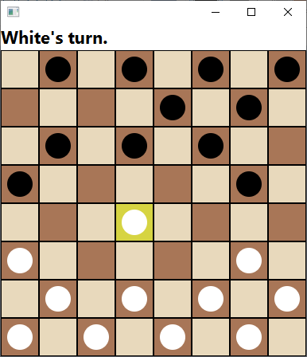

# CSCI561CheckersGUI
A minimax implementation for Checkers as part of my CSCI 561 (AI) course at USC Spring 2021. Developed using Java/JavaFX for an interactive gameplay, where you can face the minimax agent.

